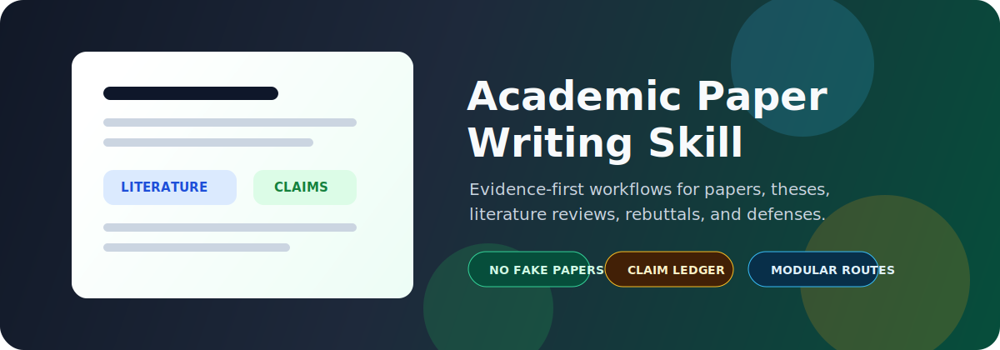
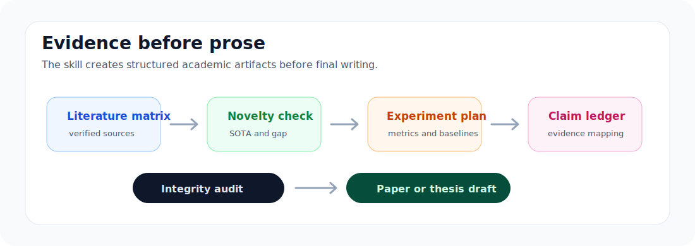
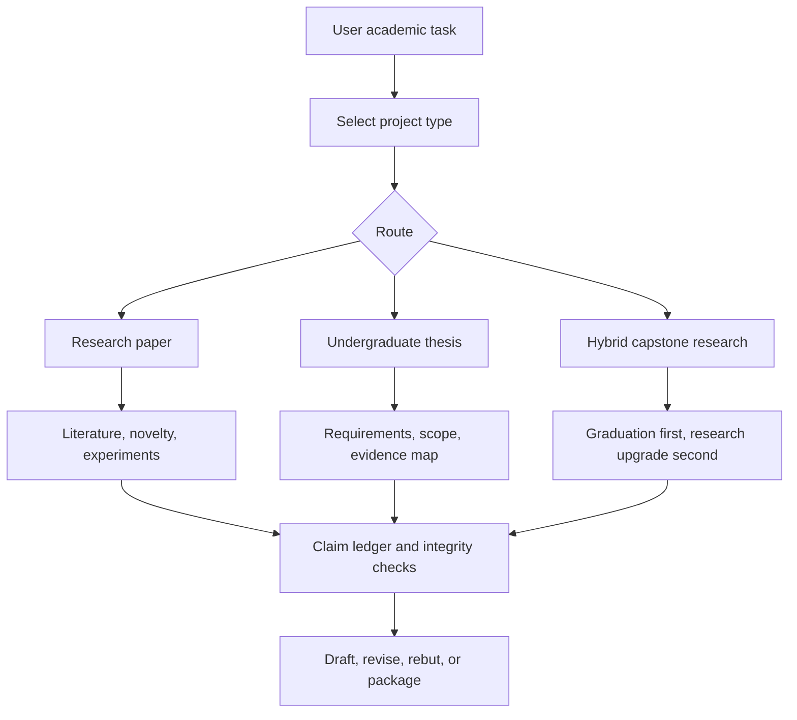

<p align="center">
  
</p>

# Academic Paper Writing Skill

<p>
  <a href="https://github.com/xcl2005/academic-paper-writing-skill/stargazers"></a>
  <a href="https://github.com/xcl2005/academic-paper-writing-skill/blob/main/LICENSE"></a>
  
  
</p>

**A modular academic writing skill for research papers, literature reviews, thesis writing, graduation projects, rebuttals, revisions, defenses, and research integrity checks.**

It is built for agents that need to help with serious academic work without hallucinating papers, inventing SOTA, fabricating results, or skipping the claim-to-evidence trail.

**Search keywords:** academic writing AI, research paper workflow, literature review matrix, thesis writing assistant, graduation project, rebuttal assistant, claim evidence mapping, research integrity, no hallucination citations, Codex skill, Agent Skill.

## Why download it

Academic writing is not just prose. A good agent has to manage sources, claims, experiments, requirements, figures, and integrity checks before it writes the final draft. This skill turns that process into a modular workflow.

| Academic risk | Built-in guardrail |
|---|---|
| Fake citations | No fabricated papers; sources must be found and verified |
| Overclaimed novelty | SOTA, benchmarks, venue policies, and tool capabilities must be rechecked |
| Weak arguments | Every strong claim maps to literature, experiment, implementation, proof, or official requirements |
| Thesis ambiguity | Unknown school/advisor/rubric requirements stay unknown until discovered |
| Messy drafting | Matrices and ledgers come before polished prose when evidence matters |
| Tool sprawl | External skills are allowed, but must not override research-integrity invariants |

<p align="center">
  
</p>

## Supported workflows

| Mode | Use it for | Typical outputs |
|---|---|---|
| Research paper | Workshop, conference, journal, related work, novelty, experiments, rebuttal, revision | Literature matrix, novelty verification, experiment matrix, claim ledger, simulated review |
| Undergraduate thesis | Proposal, midterm report, final thesis, graduation project, capstone, defense | Requirement discovery log, scope ladder, graduation evidence map, integrity checklist |
| Hybrid capstone research | Graduation-first projects that may later become papers or portfolio artifacts | Thesis MVP, evidence package, research upgrade plan |

## Project links

- [Examples](examples/) for research-paper, thesis, and rebuttal prompts.
- [Contributing guide](CONTRIBUTING.md) for academic workflow improvements.
- [Security policy](SECURITY.md) for privacy and integrity reports.
- [Skill manifest](skill_manifest.yaml) for routing, modules, modes, and protected invariants.

## Install

Clone directly into your user-wide Codex skills folder:

```bash
mkdir -p ~/.agents/skills
git clone https://github.com/xcl2005/academic-paper-writing-skill.git ~/.agents/skills/academic-paper-writing-skill
```

Windows PowerShell:

```powershell
New-Item -ItemType Directory -Force -Path "$HOME\.agents\skills"
git clone https://github.com/xcl2005/academic-paper-writing-skill.git "$HOME\.agents\skills\academic-paper-writing-skill"
```

Restart Codex if the skill does not appear automatically.

## Quick start

Ask Codex:

```text
$academic-paper-writing-skill help me plan a literature review matrix for my thesis topic
```

Initialize a project workspace:

```bash
python scripts/init_project.py --out paper_workspace --type research_paper
```

Validate the skill structure:

```bash
python scripts/validate_skill.py
```

## How it works



## Included artifacts

- `templates/literature_matrix.csv`
- `templates/novelty_verification.csv`
- `templates/experiment_matrix.csv`
- `templates/claim_ledger.csv`
- `templates/integrity_checklist.md`
- `templates/rebuttal_matrix.md`
- `templates/graduation_evidence_map.csv`
- `templates/requirement_discovery_log.md`
- `templates/project_state.yaml`

Markdown, YAML, and CSV are the canonical working formats. Word, PDF, Excel, and slides are treated as exports, not the source of truth.

## Non-negotiable invariants

This skill is strict on academic integrity:

- No fabricated papers.
- No fabricated SOTA.
- No fabricated results.
- No invented local requirements.
- Primary-source first.
- Claim-to-evidence mapping.
- Integrity before persuasion.
- Human review for final submission, authorship, ethics, and school compliance.

## Repository layout

```text
academic-paper-writing-skill/
|-- SKILL.md
|-- skill_manifest.yaml
|-- modules/
|-- templates/
|-- schemas/
|-- scripts/
|-- agents/
|-- assets/
`-- CHANGELOG.md
```

## Best for

- Students writing undergraduate theses or graduation projects.
- Researchers drafting papers, related work, experiments, or rebuttals.
- Advisors or teams who want an evidence-first workflow.
- Agent builders who need academic writing behavior that is modular, inspectable, and harder to hallucinate through.

## Suggested GitHub topics

For maximum discoverability, use these topics on GitHub:

`codex`, `codex-skills`, `agent-skills`, `academic-writing`, `research-paper`, `literature-review`, `thesis`, `research-integrity`, `claim-evidence`, `ai-agents`

## Version

`8.0.0-final-candidate`

## License

MIT. Use it, fork it, adapt it, and keep the no-fabrication rules intact.
