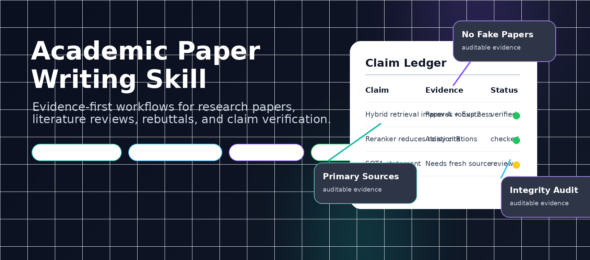

<div align="center">

<p>
  
</p>

# Academic Paper Writing Skill

**Evidence-first academic AI workflow that reduces hallucinated citations, fake evidence, unsupported claims, and integrity drift before prose generation.**

<a href="https://github.com/xcl2005/academic-paper-writing-skill/stargazers"></a>
<a href="https://github.com/xcl2005/academic-paper-writing-skill/network/members"></a>
<a href="https://github.com/xcl2005/academic-paper-writing-skill/blob/main/LICENSE"></a>
<a href="https://github.com/xcl2005/academic-paper-writing-skill/releases"></a>
<a href="https://github.com/xcl2005/academic-paper-writing-skill/actions/workflows/ci.yml"></a>


[简体中文](README.md) · English

[Quick Start](#-quick-start) · [Demo](#-demo-evidence-first-workflow) · [What you get](#-what-you-get) · [Why](#-why) · [Workflows](#-workflows) · [Integrity](#-integrity-rules)

</div>

## 🔥 Positioning

This repository is not a single academic-writing prompt, and it is not a wrapper for making unsupported claims sound better. It is an installable Agent Skill that breaks academic papers, literature reviews, research writing, experiment planning, rebuttals, and thesis workflows into verifiable modules. The agent handles sources, evidence, claims, experiments, and integrity risks before final prose.

It is designed for evidence-first academic AI assistance: build an auditable evidence package first, then draft prose, rebuttals, or defense materials. Undergraduate theses and capstone projects can use the same evidence-first workflow as compatible scenarios.

It works for Codex, Claude Code, and other agents that follow the Agent Skills folder layout. Claude Code can use the same `SKILL.md`; the install path and direct invocation syntax are different. See [Codex / Claude Code](#-codex--claude-code).

## ⭐ Star this if you...

- need academic AI help but do not want fake citations, fake SOTA, or unsupported claims;
- want literature matrices, claim ledgers, experiment matrices, and integrity checks before prose;
- support thesis / paper workflows where unknown requirements stay unknown until verified.

## 🚫 Not for

- ghostwriting papers without evidence review;
- inventing citations, SOTA, experiments, school rules, or advisor requirements;
- replacing human decisions on authorship, ethics, submission, or school compliance.

## ✨ Why

The fragile part of academic writing is rarely wording. It is broken evidence: unverified papers, exaggerated SOTA claims, planned experiments written as completed results, or invented school/advisor requirements.

**Academic Paper Writing Skill** builds inspectable intermediate artifacts before final prose. It defaults to primary sources, claim-to-evidence mapping, and integrity checks to reduce fake citations, fake results, overclaiming, and thesis requirement drift.

## 🎬 Demo: Evidence-first workflow

Input:

```text
Use $academic-paper-writing-skill to turn a RAG-based academic assistant idea into a thesis proposal scope and evidence package. Do not invent papers or school requirements.
```

After cloning, run an offline demo workspace first:

```bash
python scripts/demo_academic_workflow.py --mode undergraduate_thesis --out demo_workspace
```

The skill first creates:

1. `evidence/requirement_discovery_log.md`
2. `evidence/scope_ladder.md`
3. `evidence/graduation_evidence_map.csv`
4. `claim_ledger.csv`
5. `integrity_checklist.md`

Only then does it draft proposal prose, related work, or rebuttal text. See the fuller walkthrough in [`examples/undergraduate-thesis-proposal-demo/README.md`](examples/undergraduate-thesis-proposal-demo/README.md).

See filled output samples:

- [`examples/outputs/rag-evaluation-literature-matrix.sample.csv`](examples/outputs/rag-evaluation-literature-matrix.sample.csv)
- [`examples/outputs/rag-evaluation-claim-ledger.sample.csv`](examples/outputs/rag-evaluation-claim-ledger.sample.csv)
- [`examples/outputs/rag-evaluation-novelty-check.sample.md`](examples/outputs/rag-evaluation-novelty-check.sample.md)
- [`examples/outputs/undergraduate-thesis-evidence-map.sample.csv`](examples/outputs/undergraduate-thesis-evidence-map.sample.csv)
- [`examples/outputs/sample-source-note.md`](examples/outputs/sample-source-note.md)

Machine-check the integrity boundary:

```bash
python scripts/validate_evidence_status.py templates examples/outputs examples/fixtures
python scripts/check_claims_before_prose.py examples/fixtures/claims/unsupported-strong-claim.csv --expect-block
python scripts/validate_demo_workspace.py demo_workspace --mode undergraduate_thesis
```

## 📦 What you get

| Output | Why it exists |
|---|---|
| Literature Matrix | Records verified papers, methods, datasets, claims, limitations, and relevance |
| Novelty Verification | Checks prior work and SOTA before strong novelty claims |
| Experiment Matrix | Separates metrics, baselines, datasets, ablations, and result status |
| Claim Ledger | Maps each strong claim to sources, experiments, implementation evidence, or official requirements |
| Integrity Checklist | Catches fake citations, fake results, overclaiming, and unknown school requirements |
| Final Draft / Rebuttal | Generated only after the evidence trail is inspectable |

## 🧾 Why not just ask an AI to write the paper?

| Direct AI writing | This skill |
|---|---|
| May invent citations | Requires verified source records |
| May overclaim novelty or SOTA | Runs novelty / SOTA checks first |
| May fake completed results | Separates planned, preliminary, and achieved results |
| Writes prose too early | Builds matrices and ledgers before final prose |
| Hard to audit | Produces inspectable intermediate artifacts |

## 👨‍💻 Use Cases

| Scenario | What it helps with |
|---|---|
| Research papers | Topic scoping, related work, novelty/SOTA checks, experiment matrices, pre-submission audits |
| Literature reviews | Literature matrices by method, dataset, claim, limitation, and relevance |
| Rebuttal / revision | Simulated review, response matrices, evidence strengthening, calibrated wording |
| Undergraduate thesis / capstone | Supports proposals, midterms, final papers, defenses, and evidence materials |
| Hybrid projects | Satisfy graduation first, then decide whether to upgrade into a paper or portfolio artifact |

## 🎯 Highlights

| | Capability |
|---|---|
| 🔍 | Literature matrices for verified papers, methods, datasets, claims, and relevance |
| 🧪 | Experiment matrices for metrics, baselines, datasets, ablations, and result status |
| 🧭 | Novelty and SOTA checks before strong claims |
| 🔗 | Claim ledgers that map every strong claim to evidence |
| 🛡️ | Integrity checks that separate planned, preliminary, and achieved results |
| 🎓 | Compatible undergraduate thesis / capstone route for proposals, midterms, final papers, defenses, and evidence materials |

## 📦 Quick Start

### Codex

```bash
mkdir -p ~/.agents/skills
git clone https://github.com/xcl2005/academic-paper-writing-skill.git ~/.agents/skills/academic-paper-writing-skill
```

Windows PowerShell:

```powershell
New-Item -ItemType Directory -Force -Path "$HOME\.agents\skills"
git clone https://github.com/xcl2005/academic-paper-writing-skill.git "$HOME\.agents\skills\academic-paper-writing-skill"
```

Invocation:

```text
Use $academic-paper-writing-skill to build a literature matrix and novelty check for my paper.
```

### Claude Code

```bash
mkdir -p ~/.claude/skills
git clone https://github.com/xcl2005/academic-paper-writing-skill.git ~/.claude/skills/academic-paper-writing-skill
```

Project-local install:

```bash
mkdir -p .claude/skills
git clone https://github.com/xcl2005/academic-paper-writing-skill.git .claude/skills/academic-paper-writing-skill
```

Direct invocation:

```text
/academic-paper-writing-skill turn this capstone idea into a proposal scope and evidence checklist
```

### Workspace setup

```bash
# Create a research-paper workspace
python scripts/init_project.py --out paper_workspace --type research_paper

# Create an undergraduate-thesis workspace
python scripts/init_project.py --out thesis_workspace --type undergraduate_thesis

# Validate the skill
python scripts/validate_skill.py

# Generate an inspectable demo workspace
python scripts/demo_academic_workflow.py --mode undergraduate_thesis --out demo_workspace
```

## 🔁 Codex / Claude Code

| Item | Codex | Claude Code |
|---|---|---|
| Shared structure | `skill-name/SKILL.md`, optionally with `modules/`, `templates/`, `scripts/` | Same |
| User-level path | `~/.agents/skills/academic-paper-writing-skill` | `~/.claude/skills/academic-paper-writing-skill` |
| Project-level path | `.agents/skills/academic-paper-writing-skill` | `.claude/skills/academic-paper-writing-skill` |
| Automatic trigger | Matches the `description` to the task | Matches the `description` to the task |
| Direct invocation | `$academic-paper-writing-skill ...` | `/academic-paper-writing-skill ...` |
| README entry | Chinese default in `README.md`, English in `README_EN.md` | Same repository links |

Claude.ai / Claude API usually require uploading or registering the skill as a custom skill. The GitHub clone paths above are mainly for local Claude Code and Codex workflows.

## 🧭 Workflows

```text
Topic / Draft
  -> Source Verification
  -> Literature Matrix
  -> Claim Ledger
  -> Experiment / Evidence Matrix
  -> Integrity Check
  -> Final Draft / Rebuttal
```

| Mode | Use it for | Outputs |
|---|---|---|
| `research_paper` | papers, related work, experiments, rebuttal, revision | literature matrix, novelty check, experiment matrix, claim ledger |
| `undergraduate_thesis` | proposal, midterm, thesis, graduation project, defense | requirement log, scope ladder, graduation evidence map |
| `hybrid_capstone_research` | graduation-first projects that may become papers or portfolio work | thesis MVP, evidence package, research upgrade plan |

### Control Flow

| Step | Decision | What happens |
|---:|---|---|
| 1 | Select project type | Set `research_paper`, `undergraduate_thesis`, or `hybrid_capstone_research` |
| 2 | Identify stage | Classify topic discovery, literature, novelty, experiments, writing, revision, rebuttal, defense, or packaging |
| 3 | Load minimal modules | Read only the needed modules plus core invariants |
| 4 | Create structured artifacts | Build matrices and ledgers before final prose when evidence matters |
| 5 | Verify strong claims | Map claims to papers, experiments, implementation evidence, tests, proofs, or official requirements |
| 6 | Run integrity checks | Separate planned, preliminary, and achieved results; do not invent school/advisor/rubric requirements |
| 7 | Draft or revise | Write final prose or rebuttal only after the evidence trail is inspectable |
| 8 | Human review | Submission, authorship, ethics, compliance, and defense decisions require human confirmation |

### Module Routing

| Task | Modules normally loaded |
|---|---|
| Literature review | `00_core_invariants`, `01_agent_orchestrator`, `06_literature_engine`, `11_integrity_reproducibility_guard` |
| Novelty / SOTA check | `07_novelty_verification_and_scoring`, `11_integrity_reproducibility_guard` |
| Experiment planning | `09_experiment_matrix_engine`, `11_integrity_reproducibility_guard` |
| Figure/table planning | `10_figure_table_engine` |
| Rebuttal / simulated review | `13_simulated_review_rebuttal`, `11_integrity_reproducibility_guard` |
| Undergraduate requirement discovery | `04_requirement_discovery`, `14_undergraduate_thesis_engine`, `11_integrity_reproducibility_guard` |

## 🗂️ Artifacts

| File | Purpose |
|---|---|
| `templates/literature_matrix.csv` | Verified papers, methods, datasets, claims, and relevance |
| `templates/novelty_verification.csv` | Compare the user's idea against verified prior work |
| `templates/experiment_matrix.csv` | Metrics, baselines, datasets, ablations, and result status |
| `templates/claim_ledger.csv` | Make each strong claim auditable |
| `templates/integrity_checklist.md` | Catch fabricated, exaggerated, or unsupported statements before final prose |
| `templates/graduation_evidence_map.csv` | Undergraduate thesis / capstone evidence package |

Markdown, YAML, and CSV are the canonical working formats. Word, PDF, Excel, and slides are exports.

## 🛡️ Integrity Rules

### Integrity-first by default

This skill blocks or qualifies final prose when:

- citations are unverified;
- novelty claims are not checked against prior work;
- planned experiments are written as completed results;
- local thesis requirements are missing but treated as confirmed;
- strong claims are not mapped to sources, experiments, implementation evidence, or official requirements.

- No fabricated papers.
- No fabricated SOTA.
- No fabricated results.
- No invented school, advisor, rubric, template, defense, or workload requirements.
- Primary-source first.
- Strong claims must map to evidence.
- Submission, authorship, ethics, and school compliance need human review.

## 🛠️ Quality Checks

```bash
python scripts/validate_skill.py
python scripts/validate_readme_quality.py
```

## 📁 Repository Layout

```text
.
|-- SKILL.md
|-- skill_manifest.yaml
|-- .github/
|-- docs/
|-- modules/
|-- templates/
|-- schemas/
|-- scripts/
|-- examples/
|-- README.md
`-- README_EN.md
```

## 🔎 Search Keywords

Academic writing AI, research paper workflow, literature review matrix, thesis writing assistant, graduation project, rebuttal assistant, claim evidence mapping, research integrity, Codex skills, Claude Code skills, Agent Skills.

## 📄 License

MIT
