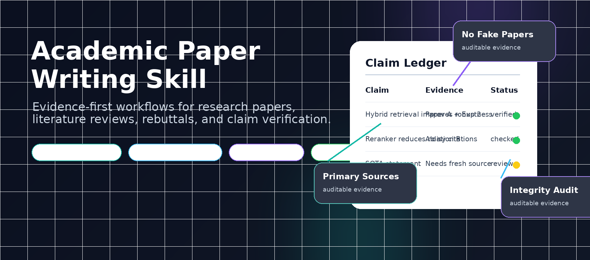

[//]: # "Academic Paper Writing Skill is an evidence-first Agent Skill for research ideation, academic search, literature review, statistics, scientific writing, peer review, rebuttals, theses, and paper-to-presentation workflows."

<div align="center">

<p>
  
</p>

# Academic Paper Writing Skill

**Turn research from one-shot generation into a traceable, reviewable, deliverable workflow.**<br>
Built for Codex, Claude Code, and Agent Skills-compatible agents, from topic ideation and scholarly search to statistics, figures, manuscripts, peer review, submission, and paper-to-presentation work.

<p>
  <a href="https://github.com/xcl2005/academic-paper-writing-skill/stargazers"></a>
  <a href="https://github.com/xcl2005/academic-paper-writing-skill/releases"></a>
  <a href="https://github.com/xcl2005/academic-paper-writing-skill/actions/workflows/ci.yml"></a>
  <a href="https://github.com/xcl2005/academic-paper-writing-skill/blob/main/LICENSE"></a>
  
</p>

[简体中文](README.md) · **English**

[Core Features](#core-features) · [Skill Directory](#skill-directory) · [Quick Start](#quick-start) · [Workflow](#workflow) · [Evidence First](#evidence-first) · [Examples](#examples)

<sub>If this workflow makes your research more reliable, consider starring the repository so more researchers can find it.</sub>

</div>

<a id="core-features"></a>

## ⚡ Core features

| Capability | What it solves |
|---|---|
| 📚 **Literature Matrix and Claim Ledger** | Verify references, synthesize papers, and connect strong claims to inspectable evidence |
| 💡 **Novelty / SOTA and ROI** | Compare against prior work, test novelty, and assess research value, risk, and minimum viable scope |
| 🧪 **Experiment Matrix and Statistics** | Organize datasets, baselines, metrics, and ablations; separate plans from results and check assumptions and uncertainty |
| ✍️ **Writing, Figures, and Integrity Checks** | Protect facts, terminology, and claim strength; review rendered artifacts and block unsupported prose |
| 🧐 **Simulated Review and Rebuttals** | Prioritize concerns and map each response to evidence, exact revisions, and unresolved actions |
| 🎓 **Theses, Capstones, and Research Delivery** | Verify institutional requirements, manage scope and evidence, and prepare proposals, submissions, defenses, and talks |

Start from a research direction, a few papers, data, a draft, or reviewer comments. The specialist skills below add task-specific detail to these core workflows.

<a id="skill-directory"></a>

## 🌐 Specialist skill directory

**18 optional skills from 3 open-source repositories.** Each skill maps to a specific research area. Click its name to read the full instructions; the source repository is linked underneath.

> Stars are dynamic counts for the **source repository**, not independent counts for each skill. These are configured optional provider interfaces, not a claim that all skills are installed.

### Plan, search, and synthesize

| Skill / source | Area · tags | Stars |
|---|---|---|
| [academic-research-suite](https://github.com/Imbad0202/academic-research-skills-codex/blob/main/skills/academic-research-suite/SKILL.md)<br><sub>[Academic Research Suite](https://github.com/Imbad0202/academic-research-skills-codex)</sub> | **Planning**<br><sub>stages · orchestration</sub> | [](https://github.com/Imbad0202/academic-research-skills-codex/stargazers) |
| [scientific-brainstorming](https://github.com/K-Dense-AI/scientific-agent-skills/blob/main/skills/scientific-brainstorming/SKILL.md)<br><sub>[Scientific Agent Skills](https://github.com/K-Dense-AI/scientific-agent-skills)</sub> | **Ideation**<br><sub>hypotheses · critique</sub> | [](https://github.com/K-Dense-AI/scientific-agent-skills/stargazers) |
| [nature-academic-search](https://github.com/Yuan1z0825/nature-skills/blob/main/skills/nature-academic-search/SKILL.md)<br><sub>[Nature Skills](https://github.com/Yuan1z0825/nature-skills)</sub> | **Search**<br><sub>multi-source · citations</sub> | [](https://github.com/Yuan1z0825/nature-skills/stargazers) |
| [paper-lookup](https://github.com/K-Dense-AI/scientific-agent-skills/blob/main/skills/paper-lookup/SKILL.md)<br><sub>[Scientific Agent Skills](https://github.com/K-Dense-AI/scientific-agent-skills)</sub> | **Lookup**<br><sub>DOI · open access</sub> | [](https://github.com/K-Dense-AI/scientific-agent-skills/stargazers) |
| [literature-review](https://github.com/K-Dense-AI/scientific-agent-skills/blob/main/skills/literature-review/SKILL.md)<br><sub>[Scientific Agent Skills](https://github.com/K-Dense-AI/scientific-agent-skills)</sub> | **Review**<br><sub>systematic · PRISMA</sub> | [](https://github.com/K-Dense-AI/scientific-agent-skills/stargazers) |

### Design, analyze, and visualize

| Skill / source | Area · tags | Stars |
|---|---|---|
| [experimental-design](https://github.com/K-Dense-AI/scientific-agent-skills/blob/main/skills/experimental-design/SKILL.md)<br><sub>[Scientific Agent Skills](https://github.com/K-Dense-AI/scientific-agent-skills)</sub> | **Design**<br><sub>controls · randomization</sub> | [](https://github.com/K-Dense-AI/scientific-agent-skills/stargazers) |
| [statistical-analysis](https://github.com/K-Dense-AI/scientific-agent-skills/blob/main/skills/statistical-analysis/SKILL.md)<br><sub>[Scientific Agent Skills](https://github.com/K-Dense-AI/scientific-agent-skills)</sub> | **Statistics**<br><sub>models · diagnostics</sub> | [](https://github.com/K-Dense-AI/scientific-agent-skills/stargazers) |
| [statistical-power](https://github.com/K-Dense-AI/scientific-agent-skills/blob/main/skills/statistical-power/SKILL.md)<br><sub>[Scientific Agent Skills](https://github.com/K-Dense-AI/scientific-agent-skills)</sub> | **Power**<br><sub>sample size · power</sub> | [](https://github.com/K-Dense-AI/scientific-agent-skills/stargazers) |
| [nature-figure](https://github.com/Yuan1z0825/nature-skills/blob/main/skills/nature-figure/SKILL.md)<br><sub>[Nature Skills](https://github.com/Yuan1z0825/nature-skills)</sub> | **Figures**<br><sub>journal figures · export</sub> | [](https://github.com/Yuan1z0825/nature-skills/stargazers) |
| [scientific-visualization](https://github.com/K-Dense-AI/scientific-agent-skills/blob/main/skills/scientific-visualization/SKILL.md)<br><sub>[Scientific Agent Skills](https://github.com/K-Dense-AI/scientific-agent-skills)</sub> | **Plots**<br><sub>panels · accessibility</sub> | [](https://github.com/K-Dense-AI/scientific-agent-skills/stargazers) |

### Draft and polish

| Skill / source | Area · tags | Stars |
|---|---|---|
| [nature-writing](https://github.com/Yuan1z0825/nature-skills/blob/main/skills/nature-writing/SKILL.md)<br><sub>[Nature Skills](https://github.com/Yuan1z0825/nature-skills)</sub> | **Drafting**<br><sub>submission · LaTeX</sub> | [](https://github.com/Yuan1z0825/nature-skills/stargazers) |
| [scientific-writing](https://github.com/K-Dense-AI/scientific-agent-skills/blob/main/skills/scientific-writing/SKILL.md)<br><sub>[Scientific Agent Skills](https://github.com/K-Dense-AI/scientific-agent-skills)</sub> | **Writing**<br><sub>IMRaD · reporting</sub> | [](https://github.com/K-Dense-AI/scientific-agent-skills/stargazers) |
| [nature-polishing](https://github.com/Yuan1z0825/nature-skills/blob/main/skills/nature-polishing/SKILL.md)<br><sub>[Nature Skills](https://github.com/Yuan1z0825/nature-skills)</sub> | **Polishing**<br><sub>academic English · fidelity</sub> | [](https://github.com/Yuan1z0825/nature-skills/stargazers) |

### Review and deliver

| Skill / source | Area · tags | Stars |
|---|---|---|
| [nature-reviewer](https://github.com/Yuan1z0825/nature-skills/blob/main/skills/nature-reviewer/SKILL.md)<br><sub>[Nature Skills](https://github.com/Yuan1z0825/nature-skills)</sub> | **Review**<br><sub>perspectives · blockers</sub> | [](https://github.com/Yuan1z0825/nature-skills/stargazers) |
| [peer-review](https://github.com/K-Dense-AI/scientific-agent-skills/blob/main/skills/peer-review/SKILL.md)<br><sub>[Scientific Agent Skills](https://github.com/K-Dense-AI/scientific-agent-skills)</sub> | **Review**<br><sub>methods · reproducibility</sub> | [](https://github.com/K-Dense-AI/scientific-agent-skills/stargazers) |
| [nature-response](https://github.com/Yuan1z0825/nature-skills/blob/main/skills/nature-response/SKILL.md)<br><sub>[Nature Skills](https://github.com/Yuan1z0825/nature-skills)</sub> | **Response**<br><sub>point-by-point · revisions</sub> | [](https://github.com/Yuan1z0825/nature-skills/stargazers) |
| [nature-data](https://github.com/Yuan1z0825/nature-skills/blob/main/skills/nature-data/SKILL.md)<br><sub>[Nature Skills](https://github.com/Yuan1z0825/nature-skills)</sub> | **Data**<br><sub>availability · FAIR</sub> | [](https://github.com/Yuan1z0825/nature-skills/stargazers) |
| [nature-paper2ppt](https://github.com/Yuan1z0825/nature-skills/blob/main/skills/nature-paper2ppt/SKILL.md)<br><sub>[Nature Skills](https://github.com/Yuan1z0825/nature-skills)</sub> | **Slides**<br><sub>paper-to-PPT · render QA</sub> | [](https://github.com/Yuan1z0825/nature-skills/stargazers) |

See [`capability_registry.yaml`](capability_registry.yaml) for complete input, output, and acceptance contracts. Third-party skills retain their own installation, release lifecycle, and license; this repository does not copy or bundle their code. Current validation covers internal workflows and offline routing, not end-to-end research execution of all 18 providers.

## Why use it

Language models can produce fluent paragraphs in seconds. The hard part is making every conclusion survive scrutiny: Are the papers real? Was the search broad enough? Were the experiments actually run? Does the statistical method match the design? Can each figure be traced to data? Are the manuscript and submission files consistent?

**Academic Paper Writing Skill** does not treat “write a paper” as one generation step. It organizes evidence for the current research stage, records unknowns, selects appropriate specialist capabilities, and checks critical artifacts before prose or final delivery.

| What you have | What you can ask it to do | What you receive |
|---|---|---|
| A broad research direction | Generate candidate questions, falsifiable predictions, minimum studies, and risk comparisons | Idea portfolio, decision record, search plan |
| Papers or keywords | Build a search protocol, screening trail, reading notes, and evidence synthesis | Literature matrix, research gaps, citation boundary |
| Data, an experiment idea, or results | Define estimands, samples, models, diagnostics, and sensitivity analyses | Study design, statistical analysis plan, experiment matrix |
| A draft, figures, or reviewer comments | Audit claims, revise prose, simulate review, and answer comments | Traceable manuscript, figure brief, rebuttal matrix |
| A nearly finished paper | Audit the submission package and turn the argument into a talk | Submission checklist, presentation brief, PPT requirements |

<a id="quick-start"></a>

## 🚀 Quick Start

### 1. Install for Codex

```bash
mkdir -p ~/.agents/skills
git clone https://github.com/xcl2005/academic-paper-writing-skill.git \
  ~/.agents/skills/academic-paper-writing-skill
```

<details>
<summary><b>Windows PowerShell</b></summary>

```powershell
New-Item -ItemType Directory -Force -Path "$HOME\.agents\skills"
git clone https://github.com/xcl2005/academic-paper-writing-skill.git `
  "$HOME\.agents\skills\academic-paper-writing-skill"
```

</details>

The helper scripts need **Python 3.10 / 3.12 + PyYAML**. Follow [runtime setup and first validation](docs/QUICKSTART.md) to create an isolated environment and install `requirements.txt`; it includes complete absolute-path commands for Windows and macOS / Linux. Relative `python scripts/...` examples below run from the skill root. Keep research output in a separate workspace. [Existing workspace updates](docs/MIGRATION.md) start with a preview and backup.

### 2. Describe a real research task

```text
Use $academic-paper-writing-skill to turn “evaluating RAG systems for scholarly QA” into an executable study.
Start with candidate questions and a search plan. Separate verified facts, paper claims, and inference;
do not invent citations or experimental results.
```

You do not need to remember internal modules or a fixed command sequence. Start from a topic, a collection of papers, a dataset, a draft, reviewer comments, or formal thesis requirements.

<details>
<summary><b>Install for Claude Code</b></summary>

User-level installation:

```bash
mkdir -p ~/.claude/skills
git clone https://github.com/xcl2005/academic-paper-writing-skill.git \
  ~/.claude/skills/academic-paper-writing-skill
```

Project-level installation:

```bash
mkdir -p .claude/skills
git clone https://github.com/xcl2005/academic-paper-writing-skill.git \
  .claude/skills/academic-paper-writing-skill
```

Invocation example:

```text
/academic-paper-writing-skill Audit this manuscript and map every major issue to evidence,
an exact revision location, and an unresolved action when necessary.
```

</details>

<a id="workflow"></a>

## 🧭 A typical task

Suppose you ask:

```text
I want to study citation reliability in multilingual RAG. Help me narrow the question,
review the literature, design the experiment, and plan the paper. No experiment has been run yet,
and every unverified paper must stay explicitly marked as unverified.
```

The skill will not immediately assemble a paper-shaped answer. It selects the capabilities needed for the current evidence and goal, while leaving reviewable artifacts behind:

| Stage | What it does | Reviewable output |
|---|---|---|
| Frame the problem | Clarify the population, scope, assumptions, unknowns, and stopping conditions | Idea portfolio, project state, decision log |
| Build the evidence base | Preserve exact queries, sources, screening reasons, paper claims, and limitations | Search protocol, screening log, literature matrix |
| Design the study | Define units, estimands, controls, bias risks, samples, metrics, and analysis | Study design, analysis plan, experiment matrix |
| Organize the argument | Connect prose, figures, and conclusions to sources, data, or analyses | Claim ledger, figure brief, terminology ledger |
| Review the delivery | Run stage gates, simulated peer review, submission checks, or rendered presentation QA | Integrity report, rebuttal matrix, submission package |

The route adapts to the task. A literature review does not force an experiment stage, and a reviewer-response task does not restart topic ideation.


<a id="evidence-first"></a>

## 🛡️ Evidence first

`claim_id → evidence_id → source / result / artifact`: claims need locatable support and an actual review record. Machine checks establish record consistency, not scientific truth. Explicitly labeled unknowns, assumptions, and limitations may remain. [Fields and gate decisions](docs/EVIDENCE_CONTRACT.md)

The goal is not merely to make prose sound academic. The research record must be strong enough to support the prose.

- **Traceable sources:** Keep verified facts, author claims, agent inference, assumptions, and user-provided information distinct.
- **Supported strong claims:** Novelty, SOTA, causal, effect, and compliance claims must map to sources, data, analysis, experiments, implementation evidence, or official requirements.
- **Honest research status:** Keep planned, exploratory, preliminary, achieved, and externally reported results separate.
- **Explicit blocking:** Missing sources, conflicting evidence, empty critical records, or unresolved statuses trigger qualification, placeholders, or a stop before final prose.
- **Human decisions remain human:** Authorship, submission, ethics, consent, restricted data, institutional compliance, and final conclusions require human confirmation.

> [!IMPORTANT]
> This project does not invent papers, DOIs, SOTA results, experimental outcomes, repository identifiers, institutional requirements, or completed rebuttal actions. It does not replace the judgment of researchers, supervisors, statisticians, ethics boards, or editors.


## 🔌 Pluggable specialist skills

You do not need to install every specialist to begin: each capability has a built-in workflow. Selection is made for the **current task**, without permanently binding the project to one repository or journal style.

1. An explicit user-selected provider wins.
2. Otherwise, selection considers the task, target format, language, and installed skills.
3. The selected skill's full instructions supply the domain, formatting, export, and QA details.
4. Output must pass the capability acceptance contract; unavailable, unsuitable, or failed providers fall back to the built-in workflow.
5. Third-party skills are never installed silently, and unpublished manuscripts or restricted data are not sent to external services without authorization.

## 🗂️ What you get

| Artifact | Purpose |
|---|---|
| `research_idea_portfolio.csv` | Compare candidate questions, predictions, minimum studies, nearest work, risks, and selection rationale |
| `search_protocol.md` / `screening_log.csv` | Reproduce database searches, deduplication, eligibility criteria, and screening decisions |
| `paper_reading_note.md` / `literature_matrix.csv` | Capture paper-level evidence and synthesize methods, findings, conflicts, and limitations across studies |
| `statistical_analysis_plan.md` / `experiment_matrix.csv` | Fix estimands, sample-size logic, models, metrics, diagnostics, ablations, and result status |
| `data_provenance.csv` / `figure_brief.md` | Trace data sources, permissions, transformations, figure claims, dimensions, and export requirements |
| `claim_ledger.csv` / `integrity_checklist.md` | Map strong claims to evidence and find blockers before writing or submission |
| `simulated_review.md` / `rebuttal_matrix.md` | Track review concerns, severity, evidence, exact revision locations, and response status |
| `submission_package_checklist.md` / `presentation_brief.md` | Reconcile submission files and turn the paper argument into a lab, defense, or conference talk |

Markdown, YAML, and CSV are the canonical reviewable formats. DOCX, PDF, XLSX, and PPTX can be final delivery formats; actual retrieval, computation, and export depend on the tools available to the agent.

## 💬 Prompt recipes

### Start from a broad direction

```text
Use $academic-paper-writing-skill to propose six independent research questions about AI-assisted peer review.
For each, give a falsifiable prediction, minimum viable study, closest prior work, failure risks,
and a transparent selection rationale. Do not draft the paper yet.
```

### Run a reproducible literature review

```text
Use $academic-paper-writing-skill to design a scoping review for this topic.
Preserve databases, exact queries, search dates, eligibility criteria, deduplication, and screening logs.
Do not treat papers without accessible full text as fully verified.
```

### Audit a manuscript

```text
Use $academic-paper-writing-skill to audit the citations, statistics, figures, and strong claims in this draft.
Classify issues as blocking, major, or minor, and provide a source location, evidence pointer,
and minimum corrective action for each one.
```

### Respond to reviewers

```text
Use $academic-paper-writing-skill to build a point-by-point rebuttal matrix.
Do not describe planned changes as completed. Every response must point to evidence,
an exact manuscript location, or an explicit unresolved action.
```

<a id="examples"></a>

## 📚 Templates and examples

- [Undergraduate thesis proposal evidence workflow](examples/undergraduate-thesis-proposal-demo/README.md)
- [Literature matrix sample](examples/outputs/rag-evaluation-literature-matrix.sample.csv)
- [Claim ledger sample](examples/outputs/rag-evaluation-claim-ledger.sample.csv)
- [Novelty-check sample](examples/outputs/rag-evaluation-novelty-check.sample.md)
- [Related-work sample blocked by the evidence gate](examples/outputs/output-related-work-blocked.sample.md)
- [Capability coverage and design sources](docs/CAPABILITY_COVERAGE.md)

Generate a fully offline, reviewable demo workspace:

```bash
python scripts/demo_academic_workflow.py \
  --mode undergraduate_thesis \
  --out demo_workspace
```

Initialize your own project:

```bash
python scripts/init_project.py --out paper_workspace --type research_paper
python scripts/init_project.py --out thesis_workspace --type undergraduate_thesis
```

## ✅ Stage gates

When a project needs a clear handoff, verify that the stage is substantively complete rather than merely checking that files exist:

```bash
python scripts/check_stage_gate.py paper_workspace --gate ideation
python scripts/check_stage_gate.py paper_workspace --gate literature
python scripts/check_stage_gate.py paper_workspace --gate analysis
python scripts/check_stage_gate.py paper_workspace --gate drafting
python scripts/check_stage_gate.py paper_workspace --gate submission
python scripts/check_stage_gate.py paper_workspace --gate presentation
```

Failures identify missing files, empty records, unresolved statuses, or blocking evidence so the next work cycle has a concrete target.

## 🔒 Integrity boundary

Good fits: research planning, paper reading, literature and systematic reviews, experimental and statistical design, scientific figures, manuscript drafting and revision, rebuttals, submission checks, theses, capstones, defenses, and research presentations.

Not a fit: evidence-free ghostwriting, fabricated citations or data, hidden limitations, bypassed ethics or institutional requirements, or replacing the author’s responsibility for the final manuscript and submission.

For unpublished manuscripts, peer-review material, personal information, restricted data, or confidential projects, establish the permitted tools and data boundary before using external providers.

## 🧪 Project validation

<details>
<summary><b>Run maintainer checks</b></summary>

```bash
python scripts/validate_skill.py
python scripts/validate_capability_registry.py
python scripts/test_provider_resolution.py
python scripts/test_stage_gate.py
python scripts/validate_readme_quality.py
python scripts/pre_prose_check.py examples/generated-demo-workspace --expect-block
```

Run the complete maintainer suite with `python scripts/check.py`. Structure-only checks return `structure_valid`; missing recorded human review returns `evidence_review_required`. Neither means a stage is complete.

GitHub Actions also checks workspace initialization, evidence statuses, strong-claim blocking, provider fallback, stage gates, and generated-example drift.

</details>

## 🤝 Contributing

[Issues](https://github.com/xcl2005/academic-paper-writing-skill/issues) and [pull requests](https://github.com/xcl2005/academic-paper-writing-skill/pulls) are welcome. High-value contributions include:

- reproducible, de-identified research cases;
- acceptance standards for new disciplines, venues, or reporting guidelines;
- tests for search, statistics, figures, citations, and export quality;
- capability adapters for new specialist skills instead of permanent hard-coded dependencies.

Read [`CONTRIBUTING.md`](CONTRIBUTING.md) and [`SECURITY.md`](SECURITY.md) before contributing.

## 📄 License

[MIT](LICENSE). Optional third-party skills are not installed with this repository; their code, content, and licenses remain with their respective projects.
